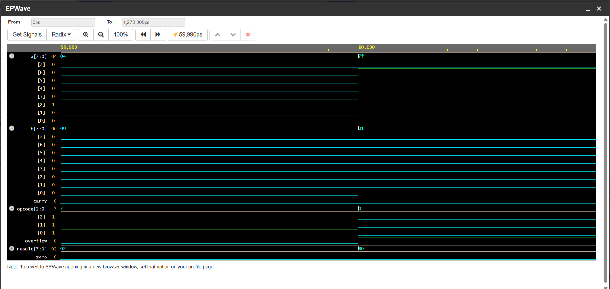

# alu-8bit-verilog

An **8-bit Arithmetic Logic Unit (ALU)** designed in **Verilog HDL**, verified using a **self-checking testbench** with directed and randomized test vectors. Simulated using **Icarus Verilog** on EDA Playground.

---

## Features

- **8 ALU Operations** – ADD, SUB, AND, OR, XOR, NOT, Shift Left, Shift Right
- **Status Flags** – Zero, Carry/Borrow, Signed Overflow
- **Self-Checking Testbench** – Independent reference model with automatic PASS/FAIL reporting
- **Directed Test Vectors** – 12 hand-picked cases covering every opcode and key edge cases
- **Randomized Test Vectors** – 200 pseudo-random cases ($random) for regression coverage
- **212 / 212 PASS, 0 FAIL** – Full verification result included below
- **Waveform Captured** – Signal transitions verified in EPWave

---

## Components / Tools Used

| Tool / Language      | Purpose                          |
|-----------------------|-----------------------------------|
| Verilog HDL           | RTL design of the ALU             |
| Icarus Verilog        | Simulation engine                 |
| EDA Playground        | Browser-based simulation platform |
| EPWave                | Waveform viewing                  |

---

## How It Works

1. **Inputs** – `a[7:0]`, `b[7:0]`, and a 3-bit `opcode` are applied to the ALU.
2. **Computation** – The ALU combinationally computes `result[7:0]` along with `zero`, `carry`, and `overflow` flags based on the selected opcode.
3. **Reference Model** – The testbench independently recomputes the expected result and flags, separate from the ALU's own logic.
4. **Comparison** – Actual output is compared against the expected output; a PASS or FAIL line is printed for every test.
5. **Directed Testing** – 12 hand-picked vectors run first, covering every opcode plus edge cases like signed overflow, borrow, and zero-result.
6. **Randomized Testing** – 200 additional random vectors are run through the same checker to catch anything the directed tests missed.
7. **Final Report** – A pass/fail tally and overall verdict are printed at the end of simulation.

---

## Opcode Table

| Opcode | Operation        |
|--------|-------------------|
| 000    | ADD               |
| 001    | SUB               |
| 010    | AND               |
| 011    | OR                |
| 100    | XOR               |
| 101    | NOT (operand A)   |
| 110    | Shift Left (A)    |
| 111    | Shift Right (A)   |

## Output Signals

| Signal      | Description                                |
|-------------|---------------------------------------------|
| result[7:0] | 8-bit result of the selected operation       |
| zero        | Set when result == 0                         |
| carry       | Carry-out (ADD) / borrow flag (SUB)          |
| overflow    | Signed overflow flag (valid for ADD/SUB only)|

---

## Verification Result
Total: 212 PASS, 0 FAIL
RESULT: ALL TESTS PASSED
Full console output available in `waveform/test_summary.png`.

## Sample Waveform

Below: a signal transition showing the signed-overflow edge case (`a=127, b=1, opcode=ADD → result=128, overflow=1`), captured in EPWave.



---

## How to Run

**Option A – EDA Playground**
1. Paste `design/alu_8bit.v` into the design panel.
2. Paste `testbench/self_check_tb.v` into the testbench panel.
3. Select **Icarus Verilog** as the simulator and click **Run**.

**Option B – Icarus Verilog (local)**
```bash
iverilog -o sim design/alu_8bit.v testbench/self_check_tb.v
vvp sim
```

---

## Notes

This project separates `design/` (the RTL implementation) and `testbench/` (the verification environment) to reflect the real-world distinction between **RTL design** and **design verification** as separate engineering disciplines.
